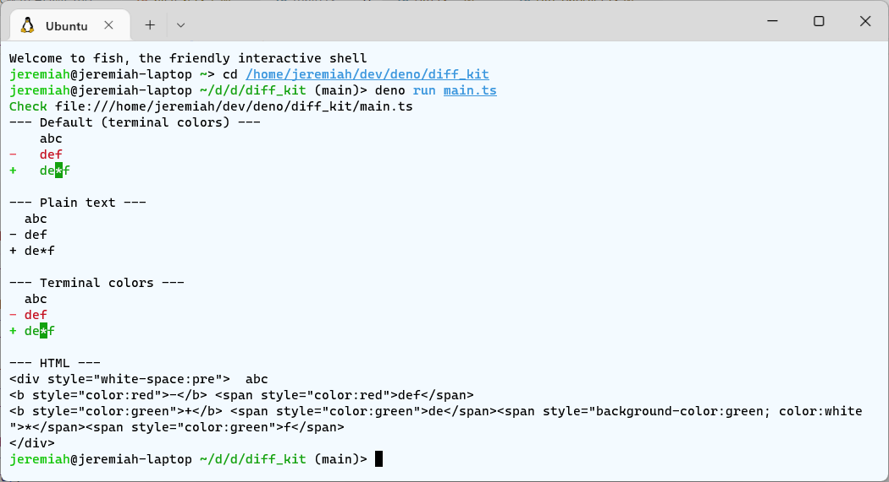

# diff_kit
Deno lib that compares 2 strings and generates result like assertEquals(), also in HTML.

## Example

```ts
import {diff, DiffText, DiffTerm, DiffHtml} from 'https://deno.land/x/diff_kit@v0.0.5/mod.ts';

const left =
`abc
def
`;
const right =
`abc
de*f
`;

console.log('--- Default (terminal colors) ---');
let result = diff(left, right);
console.log(result);

console.log('--- Plain text ---');
result = diff(left, right, new DiffText({indentWidth: 2}));
console.log(result);

console.log('--- Terminal colors ---');
result = diff(left, right, new DiffTerm({indentWidth: 2}));
console.log(result);

console.log('--- HTML ---');
result = diff(left, right, new DiffHtml({indentWidth: 2}));
console.log(result);
```



## diff()

The main function that this module is exporting is called `diff()`.

```ts
interface DiffSubj
{	readonly length: number;
	charCodeAt(i: number): number;
	slice(from: number, to: number): string;
}

function diff(left: DiffSubj, right: DiffSubj, diffHandler: DiffHandler=new DiffTerm({indentWidth: 4}))
```

The `DiffSubj` interface is string-compatible, and the most usual use case is to pass strings to the `diff()` function.

## Extending this library

This library contains 3 classes that provide visualization of the diff result: `DiffText`, `DiffTerm` and `DiffHtml`. They are subclasses of `DiffHandler`.

If you want to generate the result in a different way you can create your own subclass of `DiffHandler`.

The `DiffHandler` class has exactly this implementation:

```ts
class DiffHandler
{	protected result = '';

	addEqual(part: string)
	{	this.result += part;
	}

	addDiff(partLeft: string, partRight: string)
	{	if (partRight)
		{	this.result += '[-]';
			this.result += partRight;
		}
		if (partLeft)
		{	this.result += '[+]';
			this.result += partLeft;
		}
		this.result += '[=]';
	}

	toString()
	{	return this.result;
	}
}
```

It can be used as parameter to `diff()` without subclassing, and so the very basic plain text diff will be generated (deleted parts will be marked with `[-]...[=]`, inserted parts with `[+]...[=]`, and changed parts with `[-]...[+]...[=]`).

When passing an instance of `DiffHandler` (or it's subclass) to the 3rd parameter of `diff()`, the following methods of the handler get called:
- `addEqual(part: string)` add a text part that is the same for both the left-hand and the right-hand side of the diff.
- `addDiff(partLeft: string, partRight: string)` add part that is different. One of `partLeft` or `partRight` can be empty (but not both).
- `toString()` - at last, the object is converted to string to get the result.

The same method is not called twice in sequence. That is, for example, after `addEqual()` will be called either `addDiff()` or `toString()`.

So you can create an extension to this library, and use it in your project, or to publish it to `deno.land/x`. It's recommended to prefix the library name with `diff_kit_ex_`.
